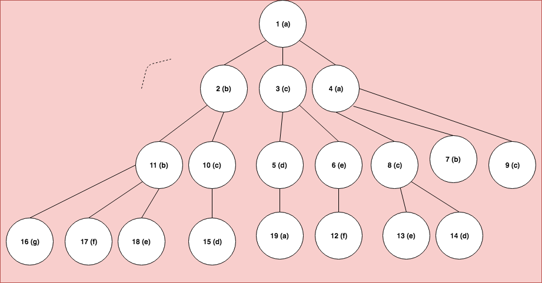
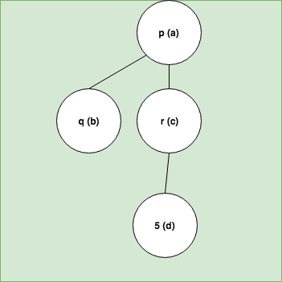
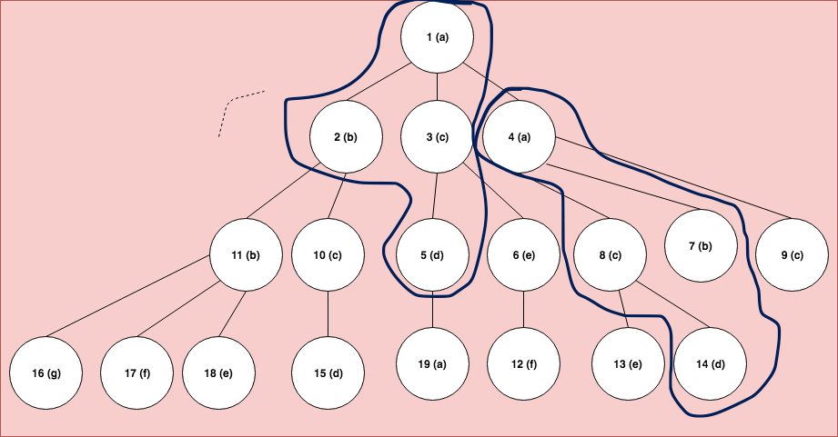
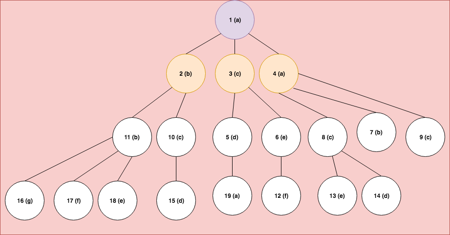

# Subtree Pattern Matching
The subtree pattern matching problem can be described as follows. 
*Given an input tree and another pattern tree, print the occurrences of the pattern tree in the input tree.* 

Let's consider the following example
- Input Tree 

- Pattern Tree

From the example, we can see that there are two occurrences of the pattern.

##### Analysing the Subtree Pattern Matching Problem

- As the goal is to print all the occurrences of the pattern in the input tree, in the worst case, there could be a exponential number of pattern matchings that can occur.
- This is because of the fact that the number of unordered subtrees in a tree is exponential. For the matching, we would need to check if two subtrees are isomorphic.
- Using the above notion we can come up with the idea that if the tree is traversed and all the subtrees are generated – for every subtree generated, we could check if the subtree is a match or not. This is a brute force solution to the problem. 
- There cannot be a polynomial time solution to the problem because we are bound by the number of subtrees as we have to atleast be printing them if each and every subtree is a match. Hence, time is lowerbound by the number of subtrees.

##### Solving the Subtree Pattern Matching Problem

We can come up with the following recurrence. 
***The subtrees starting from any node can be computed by using subtrees of its children in combination and passing via this node.***

From the diagram above, we can see that 1 has three children : 2,3,4. So if we would like to get all the subtrees starting from node 1, we would need to figure out the subtrees starting from 2,3 and 4. Once we figure out those subtrees, we can use them to compute the answer for node 1.

>That is done by using the following idea. 
The subtrees starting from 1 would include all possible combinations of subtrees starting from its children. Let us denote function num(i) as the number of subtrees starting from node i.
*num(1) = num(2) + num(3) + num(4) + num(2)* x *num(3) + num(2)* x *num(4) + num(3)* x  *num(4) + num(2)* x *num(3)* x *num(4) + 1*

What the above equation says is : 
- For all subtree combinations of the current node's children, we would need them to pass via the current node. 
- Since there could be many such combinations of subtrees, we would need to check all of them. There could 2 x 2 x 2 = 8 combinations which is basically all the subsets of the set <2,3,4>. This in code can be solved by bitmasks. 
- So essentially, if the subtrees of all the children are computed, we would need to merge them in combination with subtrees of its siblings(the current node's other children). 
- This requires a merge step which merges all subtrees of the subset in consideration via the current node. 
- This would give all subtrees starting from the current node.

Since we have formulated the recurrence for any node, we can extend this for all nodes in the tree and the answer is a union of all the subtrees starting from each node.

>Now, once all the subtrees are retrieved, we need to do a matching step with the pattern. This is checking for tree isomorphism, if two trees are isomorphic to each other. For this, hashing lists in python help a lot since the hash computed for a list remains the same irrespective of the order. hash([1,2,3]) equals hash([2,3,1])

So, our final answer would simply require comparison of hashed values for all subtrees with the pattern.
